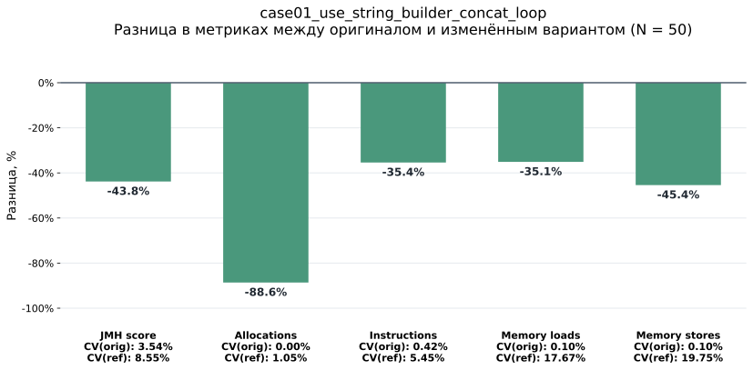
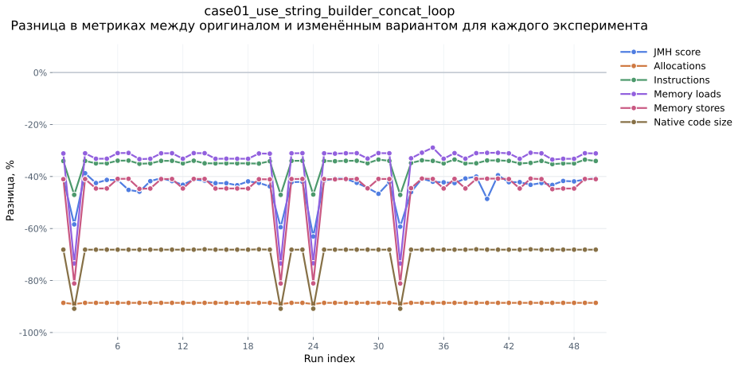
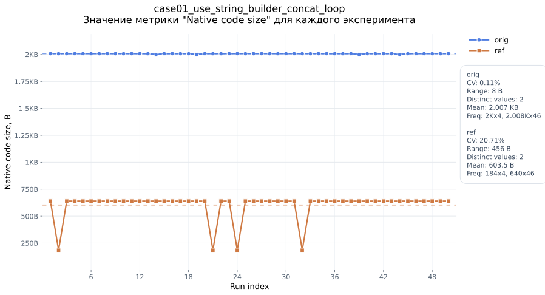

# Reproducer

The reproducer runs curated JIT instability cases from `reproducer/cases`.
Each case contains a `baseline` Java source and an equivalent `variant` Java source.

It can:

- discover valid baseline/variant pairs;
- compile each pair into isolated class directories;
- run Comparator on each pair through JMH;
- collect JIT logs, JMH JSON results, and perf-backed metrics;
- repeat whole-case executions with `--runs`;
- write per-run CSV files and per-case aggregate CSV files.

## Requirements

- Linux with working `perf`;
- JDK with `java` and `javac` on `PATH`;
- Gradle wrapper from this repository.

The runner checks `perf --version` and `perf stat -e instructions -- sleep 0.1`
before starting expensive work.

## Usage

Run all cases once:

```bash
python3 reproducer/run.py --runs 1
```

Run selected cases by prefix:

```bash
python3 reproducer/run.py --runs 3 --include-cases case01,case03
```

Useful options:

- `--runs N` - required number of whole-case repeats;
- `--include-cases case01,case03` - comma-separated case-id prefixes;
- `--session-id NAME` - fixed output session name;
- `--cases-root PATH` - custom cases directory;
- `--runs-root PATH` - custom output directory.

## Output

Each run creates a session under `reproducer/runs/<session_id>` and updates
`reproducer/runs/latest` when symlinks are supported.

Important files:

- `metadata.json` - tools, environment, selected cases, Gradle classpath output;
- `index.csv` - one row per case run;
- `cases/<case_id>/runs/run-001/status.json` - run status or captured failure;
- `cases/<case_id>/runs/run-001/logs/*.log` - stdout and stderr for `javac` and Comparator commands;
- `cases/<case_id>/runs/run-001/comparisons.csv` - raw Comparator CSV;
- `cases/<case_id>/runs/run-001/artifacts/*` - JIT logs and JMH results;
- `cases/<case_id>/all_runs.csv` - concatenated rows across runs;
- `cases/<case_id>/summary.csv` - count, mean, stdev, min, and max per role.

## Plotting

**Generate a mean-difference PDF for one case:**

```bash
python3 reproducer/plotting/mean_difference.py \
  reproducer/runs/example-session/cases/example-case
```

By default this reads the case `summary.csv` and creates:

```text
reproducer/runs/example-session/cases/example-case/mean_difference.pdf
```

Example plot:



The chart includes five aggregated metrics: JMH score, allocations,
instructions, memory loads, and memory stores.

**Generate a per-run relative-difference PDF for one case:**

```bash
python3 reproducer/plotting/run_difference.py \
  reproducer/runs/example-session/cases/example-case
```

By default this reads the case `all_runs.csv` and creates:

```text
reproducer/runs/example-session/cases/example-case/run_difference.pdf
```

Example plot:



The chart includes six per-run metrics: JMH score, allocations, instructions,
memory loads, memory stores, and native code size.

**Generate raw per-metric PDFs for one case:**

```bash
python3 reproducer/plotting/metric_difference.py \
  reproducer/runs/example-session/cases/example-case
```

By default this reads the case `all_runs.csv` and creates one PDF per metric
under:

```text
reproducer/runs/example-session/cases/example-case/metric_difference/
```

Example plot:



The charts include six raw metrics: JMH score, allocations, instructions,
memory loads, memory stores, and native code size.
